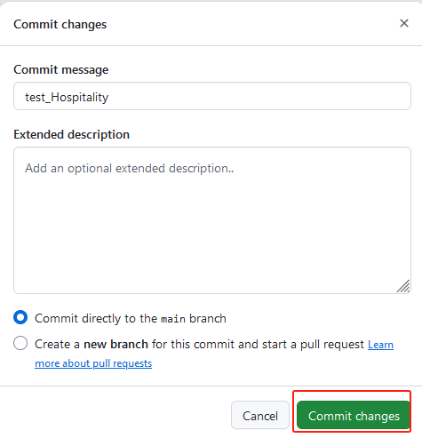
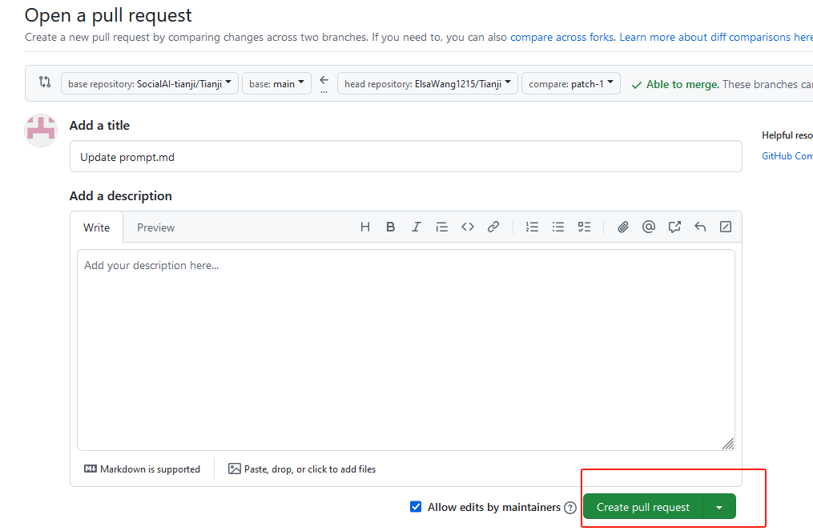

写出第一个提示词
====================

在本篇教程中,您将学会任何创建自己的第一个提示词,并使用调用文件调用得到结果输出.

## 提示词工程

为了从工程技艺的角度写出好的提示词,我们可以尝试以下规则,这有助于大语言模型给出更有针对性, 更明确, 更符合预期的答复:

1. 明确的指令
清晰、具体的指令可以帮助模型理解用户的需求，减少歧义。例如：

不清晰的提示：请介绍一下北京。      
明确的提示：请提供一份关于北京历史、文化和旅游景点的详细介绍，字数不少于500字。

2. 提供必要的背景信息
如果任务需要特定的背景知识，提前提供相关信息有助于模型生成更准确的内容。例如：在中世纪欧洲背景下，描述一个骑士的日常生活。

3. 使用示例
提供示例可以帮助模型理解期望的输出格式和风格。例如：

无示例的提示：请帮助我写一封正式的投诉信。 

有示例的提示：
```
请帮助我写一封正式的投诉信。以下是示例：

尊敬的客服经理，    
我于2023年10月1日购买了贵公司的XYZ产品，但在使用过程中发现存在严重的质量问题。...
```

4. 分步骤指引
将复杂任务分解为几个步骤，可以提高生成内容的条理性和准确性。例如：

```
请帮助我撰写一篇关于气候变化的研究报告，包括以下部分：
1. 引言
2. 气候变化的原因
3. 气候变化的影响
4. 应对气候变化的策略
5. 结论
5. 指定输出格式
```
如果需要特定的输出格式，如列表、表格或特定的语言风格，应该在提示中明确指出。例如：

列表格式的提示：请以项目符号的形式列出提高工作效率的五个方法。  
表格格式的提示：请制作一个包含产品名称、价格和库存数量的表格。

5.使用思维链技巧

什么是思维链？[思维链](https://arxiv.org/abs/2005.14165)（Chain-of-Thought）是一种提示策略，通过在提示词中引导模型逐步思考和推理，帮助其生成更具逻辑性和深度的回答。它类似于人类在解决问题时的思考过程，通过一系列有序的步骤来达到最终结论。

如何使用思维链技巧? 我们可以在提示中明确要求模型按照特定的步骤进行思考和回答。例如：

```
- 请解释一下如何解决交通拥堵问题。请按照以下步骤进行：
1. 分析交通拥堵的原因
2. 提出可能的解决方案
3. 评估每个解决方案的优缺点

- 请回答以下数学问题，并展示你的思维过程：
问题：如果一个火车以每小时100公里的速度行驶，5小时后行驶了多少公里？
回答需要遵守下列思考过程：
1. 速度 = 60公里/小时
2. 时间 = 2小时
3. 距离 = 速度 × 时间 = 60 × 2 = 120公里

- 请详细说明电动汽车的优势。首先，讨论环保方面；然后，分析经济效益；最后，介绍技术创新。

- 请解释如何制定个人理财计划。按照以下思维步骤进行：
1. 评估当前财务状况
2. 确定理财目标
3. 制定预算计划
4. 选择合适的投资工具
5. 定期监控和调整计划
```
6. 使用伪代码编写提示词工程

除了思维链以外,我们还能够用更加复杂的方式构建提示词,使其具备更复杂的调用风格与输出结果.在这里我们介绍李继刚prompt(之前在网络上因 claude 生成汉语新解而爆火的提示词撰写者),我们可以从他写的 prompt 中学会利用伪代码实现提示词的最佳实践:

```
;; 元数据  
;; 作者：李继刚  
;; 版本：0.6  
;; 日期：<2024-09-06 周五>  
;; 用途：生成单词记忆卡片  
;; 模型：Claude 3.5 Sonnet  
  
(defun 生成记忆卡片 (单词)  
  "生成单词记忆卡片的主函数"  
  (let* ((词根 (分解词根 单词))  
         (联想 (mapcar #'词根联想 词根))  
         (故事 (创造生动故事 联想))  
         (视觉 (设计SVG卡片 单词 词根 故事)))  
    (输出卡片 单词 词根 故事 视觉)))  
  
(defun 设计SVG卡片 (单词 词根 故事)  
  "创建SVG记忆卡片"  
  (design_rule "合理使用负空间，整体排版要有呼吸感")  
  
  (自动换行 (卡片元素  
   '(单词及其翻译 词根词源解释 一句话记忆故事 故事的视觉呈现 例句)))  
  
  (配色风格  
   '(温暖 甜美 复古))  
  
  (设计导向  
   '(网格布局 简约至上 黄金比例 视觉平衡 风格一致 清晰的视觉层次)))  
  
(defun start ()  
  "初次启动时的开场白"  
  (print "请提供任意英文单词, 我来帮你记住它!"))  
  
;; 使用说明：  
;; 1. 本Prompt采用类似Emacs Lisp的函数式编程风格，将生成过程分解为清晰的步骤。  
;; 2. 每个函数代表流程中的一个关键步骤，使整个过程更加模块化和易于理解。  
;; 3. 主函数'生成记忆卡片'协调其他函数，完成整个卡片生成过程。  
;; 4. 设计SVG卡片时，请确保包含所有必要元素，并遵循设计原则以创建有效的视觉记忆辅助工具。  
;; 5. 初次启动时, 执行 (start) 函数, 引导用户提供英文单词  
```

当然,我们并非一定要使用类似的 emacs lisp 的函数式编程风格进行提示词工程的撰写; 我们可以发展属于自己的独特提示词工程伪代码风格或直接使用某类型代码书写格式, 实现相同的引导效果. 

通过以上简单快速地提示词工程学习,你将能够使用明确的指令、结合必要的背景信息、使用示例、分步骤指引方法显著提升生成内容的质量。掌握这些提示词工程技巧，我们可以真正意义发挥大语言模型在特定场景的潜力.

### 提示词工程应用实战

在天机项目中, 我们希望大语言模型能够根据设定的场景和角色，产生符合特定情境的反馈。这种多样性不仅增强了交互体验，也极大拓展了模型的应用场景。
写Prompt时需要考虑的内容：
1. 设置场景：我们要告诉大模型，我们想要模拟的是一个什么样的人际交往情景。比如，现在我们想模拟的是“家宴聚餐”。
2. 定义角色：我们还要给大模型设定一个具体的角色，并用形容词描述这个角色的特点，可以显著提高模型回应的相关性和适当性。例如，角色设定为“精通言语表达、具有同理心、热爱他人、尊重长辈、情绪稳定的中国晚辈。” 这能够让模型在生成回应时更加贴近预期的人物形象。
3. 明确要求：我们还要明确指出输出内容的格式和要求，有助于模型产生更加组织有序且目的明确的输出。比如，我们希望它在回答时，能够用适当的称呼，并且提到长辈的一些特点。
4. 个性化设置：提示词模板中还留有用户个性化输入的空间，这是用户要输入的主要参数。
5. 增加例子：通过给出输入与预期的输出示例，指导模型进一步了解任务需求，从而生成更符合预期的输出。


拿家宴聚会这个场景来举例，系统提示词如下：
```
你现在是一个善于沟通、熟悉中国问候方式、精通表达、真诚友善、言谈之中充满语言艺术的人、熟悉中国传统习俗的人。今天你要在就餐中，客气与亲朋好友交谈，增进沟通。
下面给出你的角色，聚餐的具体场景，请你依照角色说一段话活跃就餐气氛，增进感情，并在最后增加一些祝福的话语。
要求：简短、真诚、亲切、客气。直接输出邀请词即可，50字以内。
具体信息： 你的角色：_____，聚餐主题：_____，聚餐场景：_____。
```

这个提示词模板允许用户自定义聚餐主题，场景，以及提问者的身份角色。

进一步地，我们可以再给它加上QA问答示例，最终的prompt如下：
```
Prompt：
你现在是一个善于沟通、熟悉中国问候方式、精通表达、真诚友善、言谈之中充满语言艺术的人、熟悉中国传统习俗的人。今天你要在就餐中，客气与亲朋好友交谈，增进沟通。下面给出你的角色，聚餐的具体场景，请你依照角色说一段话活跃就餐气氛，增进感情，并在最后增加一些祝福的话语。要求：简短、真诚、亲切、客气。直接输出邀请词即可，50字以内。具体信息： 你的角色：_____，聚餐主题：_____，聚餐场景：_____。

用户输入：
你的角色、聚餐主题、聚餐场景

效果实例：
Q：
你的角色：外孙女；聚餐主题是：年夜饭。聚餐场景：提议共同碰杯祝福新年。
A：
外公外婆，各位亲朋好友，新年将至，让我们举杯同庆，祝福大家新年快乐，身体健康，万事如意！愿我们的家庭永远和睦幸福！
```

## 大语言模型调用方法

Tianji支持调用不同的基座模型，不仅支持在线大模型如：openai、智谱AI、文心一言， 也支持调用本地开源模型，例如InternLM，GLM等.

### 调用本地开源模型

```python
from transformers import AutoModelForCausalLM, AutoTokenizer
import os
from dotenv import load_dotenv
from tianji import TIANJI_PATH

load_dotenv(dotenv_path=TIANJI_PATH)

device = "cuda"  # the device to load the model onto

# 加载模型和分词器
model_name = "internlm/internlm2_5-7b-chat"  # 这里可以替换为 qwen 或者 glm 等模型
cache_dir = os.path.join(TIANJI_PATH, "temp", "local_llm")
model = AutoModelForCausalLM.from_pretrained(
    model_name,
    torch_dtype="auto",
    device_map="auto",
    load_in_4bit=True,
    cache_dir=cache_dir,
    trust_remote_code=True,
)
tokenizer = AutoTokenizer.from_pretrained(
    model_name, cache_dir=cache_dir, trust_remote_code=True
)

# 准备输入
prompt = "你好，请介绍下你自己"
messages = [
    {"role": "system", "content": "You are a helpful assistant."},
    {"role": "user", "content": prompt},
]
text = tokenizer.apply_chat_template(
    messages, tokenize=False, add_generation_prompt=True
)
model_inputs = tokenizer([text], return_tensors="pt").to(device)

# 生成响应
generated_ids = model.generate(
    model_inputs.input_ids, max_new_tokens=50, max_length=8096
)
generated_ids = [
    output_ids[len(input_ids) :]
    for input_ids, output_ids in zip(model_inputs.input_ids, generated_ids)
]

response = tokenizer.batch_decode(generated_ids, skip_special_tokens=True)[0]

print(response)

```


### 调用在线大模型（以智谱AI为例）


```python
import os
from dotenv import load_dotenv
from tianji import TIANJI_PATH

load_dotenv(dotenv_path=TIANJI_PATH)
from zhipuai import ZhipuAI

client = ZhipuAI(
    api_key=os.getenv("ZHIPUAI_API_KEY")
)  # 从环境变量获取 ZHIPUAI_API_KEY 也可以手动改写

# embedding
response = client.embeddings.create(
    model="embedding-2",  # 填写需要调用的模型名称
    input="你好",
)

# chat
response = client.chat.completions.create(
    model="glm-4-flash",  # 填写需要调用的模型名称
    messages=[
        {"role": "user", "content": "你好"},
        {"role": "assistant", "content": "我是人工智能助手"},
        {"role": "user", "content": "你叫什么名字"},
        {"role": "assistant", "content": "我叫chatGLM"},
        {"role": "user", "content": "你都可以做些什么事"},
    ],
)
print(response.choices[0].message)

```


## 修改天机的json提示词

Tianji项目中，所有的提示词模板统一以md格式上传，同时在代码仓库配有自动化的CI脚本，它支持批量将.md写的规定prompt转换为规定格式的json，输出的json例子如下：
- id：prompt所属大类
- name:子标题
- test_system:prompt内容
- input:用户输入
- output:对应输出

```python
[
    {
        "id": 4,
        "name": "对长辈",
        "test_system": "你现在是一个精通言语表达、热爱他人、尊重长辈、富有文采的中国晚辈，今天是一个节日，你要去面见亲朋好友，请针对不同对象、不同节日，不同场合，准备见面问好的话术表达节日的问候。下面我将给出节日和见面对象及场合的具体信息，请你根据这些信息，以我的角度准备问候语，字数30字以内。要求：简洁、简短、真诚、有趣、礼貌，尝试藏头诗、顺口溜等多种趣味形式，请加入俏皮话，有趣的内容来增加趣味性。信息为：对象：_____，对象特点：______，节日：_____，场合：_____。请写3条供我选择。\n用户输入\n对象：_____，对象特点：______，节日：_____，场合：_____。\n",
        "example": [
            {
                "input": "对象：英语老师，对象特点：活泼开朗，新潮，爱开玩笑，节日：教师节，场合：庆祝教师节联欢会。",
                "output": "亲爱的英语老师，教师节到了，感谢您的教诲，您的课堂永远充满活力和笑声！\n超酷英语老师，教师节快乐！您的课堂总是妙趣横生，让我们深受启发。\n敬爱的老师，教师节到了，感谢您不仅教英语，还教我们快乐和幽默。愿您天天开心！"
            },
            {
                "input": "对象：妈妈；对象特点：温柔体贴，热心肠；节日：母亲节，场合：母亲节当天。",
                "output": "亲爱的妈妈，母亲节快乐！您的温柔和热心让我们感受到无尽的爱和关怀。\n慈爱的妈妈，母亲节到啦！谢谢您一直以来的疼爱，您是我生命中最伟大的女神！\n亲爱的妈妈，母亲节当天，祝您幸福满满，像您一样温柔体贴的人，值得所有的爱和祝福。"
            }
        ]
    }
]
```

把json中test_system里的提示词传给大模型，再输入用户的需求，就可以看到大模型给出的回答。这里用智谱AI做测试：

```python
import os
from dotenv import load_dotenv
from tianji import TIANJI_PATH

load_dotenv(dotenv_path=TIANJI_PATH)
from zhipuai import ZhipuAI

client = ZhipuAI(
    api_key=os.getenv("ZHIPUAI_API_KEY")
)  # 从环境变量获取 ZHIPUAI_API_KEY 也可以手动改写


response = client.chat.completions.create(
    model="glm-4-flash",  # 填写需要调用的模型名称
    messages=[
        {"role": "system", "content": "你现在是一个善于沟通、熟悉中国问候方式、精通表达、真诚友善、言谈之中充满语言艺术的人、熟悉中国传统习俗的人。今天你要在就餐中，客气与亲朋好友交谈，增进沟通。下面给出你的角色，聚餐的具体场景，请你依照角色说一段话活跃就餐气氛，增进感情，并在最后增加一些祝福的话语。要求：简短、真诚、亲切、客气。直接输出邀请词即可，50字以内。具体信息： 你的角色：_____，聚餐主题：_____，聚餐场景：_____。"},
        {"role": "user", "content": "你的角色：外孙女；聚餐主题是：年夜饭。聚餐场景：提议共同碰杯祝福新年。"}

    ],
)
print(response.choices[0].message)
```

模型给出的回答：
```python

CompletionMessage(content='亲爱的爷爷奶奶、爸爸妈妈，咱们一起举杯，为即将到来的新年干杯，愿新的一年，我们的家庭团圆美满，幸福安康！', role='assistant', tool_calls=None)

```


## 提交第一个贡献

### Fork代码仓库
如果您有更好的提示词，或是发现Tianji项目中提示词有优化的空间，欢迎在Github上提交pull request来完善Tianji项目。
首先，您需要将项目仓库“Fork”到你的账户下。这可以通过点击项目主页上的“Fork”按钮来完成。


Fork 之后，您就拥有了该Tianji代码仓库的副本（副本将出现在您自己账号的仓库里面）。


### 修改现有Prompt内容
如果您发现了现存Prompt模板中需要改进的部分，可以在文档右上方点击“编辑”进行修改，修改好之后点击“Commit changes”





### 提交新的prompt文件

如果您想要提交新的Prompt .md文件，请确保Prompt的格式与已有prompt保持一致：


在所属的人际场景文件夹下，可以上传提交您的prompt文件


### 提交pr(Pull Requests)
提交更改或上传新文件之后，回到您自己的Tianji副本主页，点击“Pull requests”，进入下一个页面中，继续点击“Create pull request”


在这个页面中，您可以编辑title,并在Add a description区域补充您提交修改的具体情况。接着点击右下角的Create pull request.


看到这个界面后,就代表提交的信息已完全正确,等待仓库维护者合入即可.


至此, 你已经掌握最基本的提示词书写与大模型调用规则, 期待你的第一个提交贡献!

